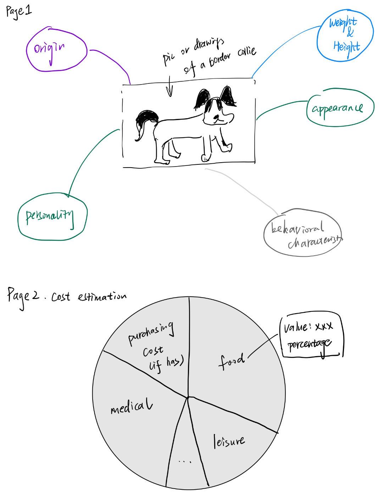
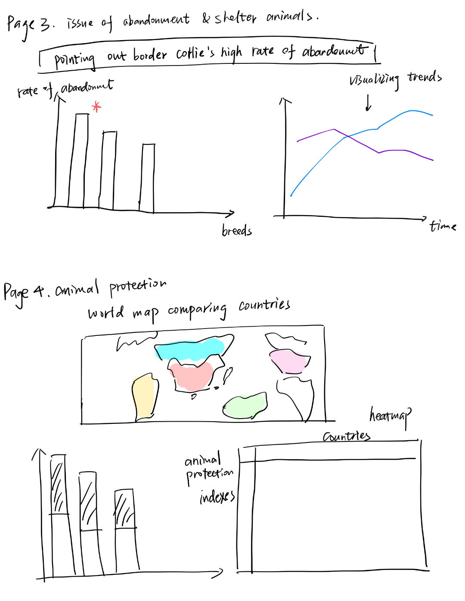

| [home page](https://zttcoder.github.io/zyw-portfolio-2026.3/) | [data viz examples](dataviz-examples) | [critique by design](critique-by-design) | [final project I](final-project-part-one) | [final project II](final-project-part-two) | [final project III](final-project-part-three) |

> Important note: this template includes major elements of Part I, but the instructions on Canvas are the authoritative source.  Make sure to read through the assignment page and review the rubric to confirm you have everything you need before submitting.  When done, delete these instructions before submitting.

# Outline
> Include a high-level summary of your project.  This should be a couple paragraphs that describe what you're interested in showing with your final project. 

> A project structure that outlines the major elements of your story.  Your Good Charts text talks about story structure in Chapter 8 - you should describe what you hope to achieve.  Make sure the outline is detailed enough that we can see how you anticipate your story unfolding.  You can incorporate your Story Arc from the in-class exercise along with your user stories and one sentence summary to make the topic even more clear. 

#### This project aims to build a narrative-driven webpage that explores the story of Border Collies as both a beloved and often misunderstood dog breed, and uses this as a lens to discuss broader issues of pet abandonment and animal welfare.

The webpage will begin with an introduction to Border Collies, including their origin, personality traits, and typical behavioral characteristics. 

Next, the project will highlight the real-life responsibilities of owning a Border Collie. It will break down the required resources in terms of time, financial cost, and daily effort. By presenting these requirements in a clear and structured way, this section aims to correct common misconceptions and show that owning such a high-energy breed is a long-term commitment rather than a casual decision.

Building on this, the narrative will transition to a critical issue: the relatively high abandonment rate of Border Collies. Also, the discussion will then expand to a broader social perspective, connecting individual cases to the larger problem of abandoned and stray dogs. This section will explore how pet abandonment reflects gaps in awareness, education, and social responsibility.

Later, the project will examine animal protection laws across different countries. It will compare when these laws were introduced, what they regulate (e.g., abandonment penalties, welfare standards), and how effective they have been in reducing animal neglect and improving welfare outcomes.

Finally, the webpage will conclude with a call to action. It will encourage users to make informed and responsible decisions before adopting a pet, and to respect animal life even if they choose not to own one. The goal is to leave users with a deeper understanding of both the joy and responsibility that come with pet ownership, as well as a broader awareness of animal welfare issues.

## Initial sketches
> Post images of your anticipated data visualizations (sketches are fine). They should mimic aspects of your outline, and include elements of your story.

Page 1: Introduction to Border Collies
The first page centers around an image or illustration of a Border Collie. Around the image, key attributes of the breed are displayed, including origin, weight and height, appearance, personality, and behavioral characteristics. This layout provides a quick and engaging overview of the breed’s basic information.

Page 2: Cost Estimation
The second page uses a pie chart to show the estimated cost of owning a Border Collie. Each segment represents a percentage of the total cost, helping users understand the financial commitment.

Page 3: Abandonment and Shelter Issues
The third page focuses on the issue of dog abandonment. A bar chart compares abandonment rates across different dog breeds, highlighting the relatively high rate for Border Collies. Next to it, a line chart shows trends over time, such as changes in abandonment rates or shelter intake, to provide a broader view of the problem.

Page 4: Animal Protection
The fourth page presents a global perspective on animal protection. A world map compares different countries based on animal welfare conditions or policies. Below or beside the map, a bar chart shows animal protection indexes for selected countries. There is also space for a heatmap or table to further compare countries across multiple dimensions.

# The data
> A couple of paragraphs that document your data source(s), and an explanation of how you plan on using your data. 

> A link to the publicly-accessible datasets you plan on using, or a link to a copy of the data you've uploaded to your Github repository, Box account or other publicly-accessible location. Using a datasource that is already publicly accessible is highly encouraged.  If you anticipate using a data source other than something that would be publicly available please talk to me first. 

| Name | URL | Description |
|------|-----|-------------|

Name: boder collie basic information  url: https://www.akc.org/dog-breeds/border-collie/

Description: basic data of border collie including their origin, personality traits, and typical behavioral characteristics

Name: cost estimation  url: https://insurify.com/pet-insurance/knowledge/how-much-is-a-border-collie/

Description: estimated cost associated with raising a border collie

Name: shelter animals data  url : https://www.shelteranimalscount.org/

Description: national data platform that collects and shares information about animals in shelters across the United States. It provides reliable and transparent data on pet intake, adoption, transfer, and outcomes

Name: animal protection comparison around the world  url : https://api.worldanimalprotection.org/

Description: It provides access to global data related to animal welfare and protection. It allows users to retrieve structured data about how different countries treat animals, including laws, policies, and welfare standards.

# Method and medium
> In a few sentences, you should document how you plan on completing your final project.

First, I will collect data from multiple sources, including but may not limited to the platforms listed above. Based on the needs of the visualization design, I will perform initial data cleaning and organization.

Then, I will use tools introduced in this course, such as Tableau, Shorthand, and Datawrapper, to develop different types of visualizations.

Finally, I will use GitHub to implement and publish the webpage for the project.

This is more like a preliminary plan, during the developing process of this project, I will try to make adjustments and refine based on the work in progress. Also, I would try to adopt the critique and advice from classmaates, professor and TAs. Also, I will focus on the story arc and call to action part in order to make it a more logical, impactful story-telling of data.

## References
_List any references you used here._

## AI acknowledgements
_If you used AI to help you complete this assignment (within the parameters of the instruction and course guidelines), detail your use of AI for this assignment here._

I used chatGPT to help me rephrase and organize some of my thoughts.

